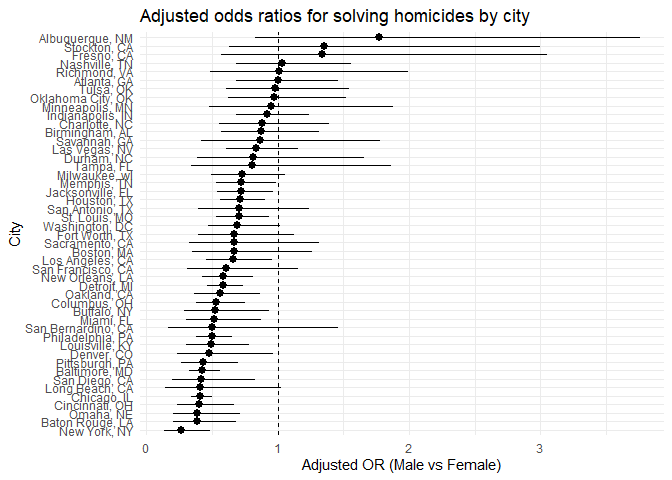
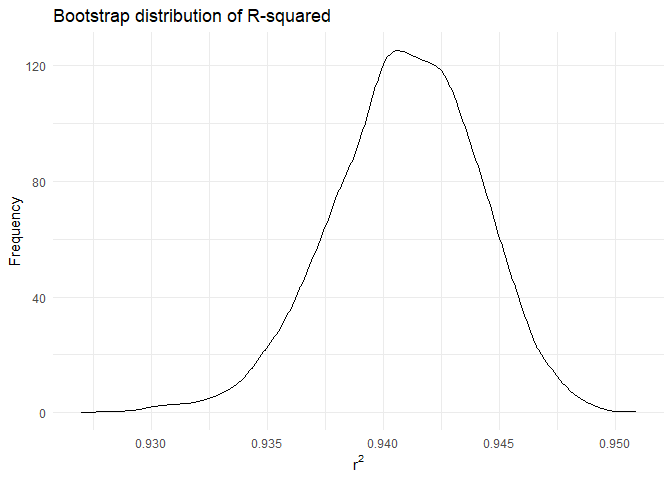
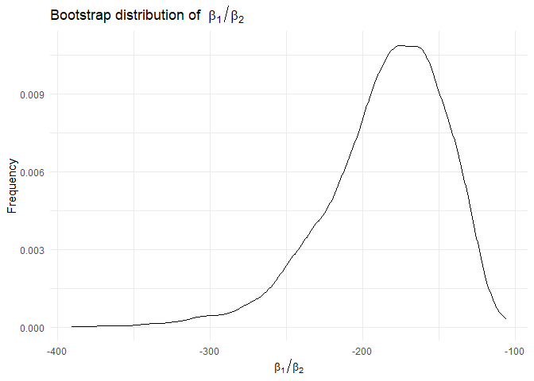
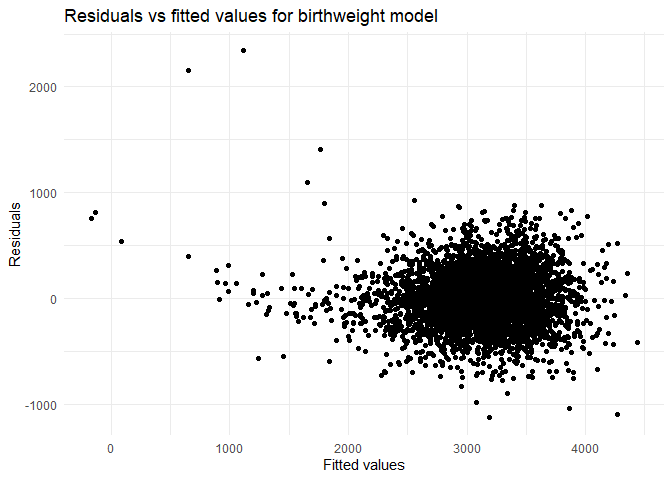
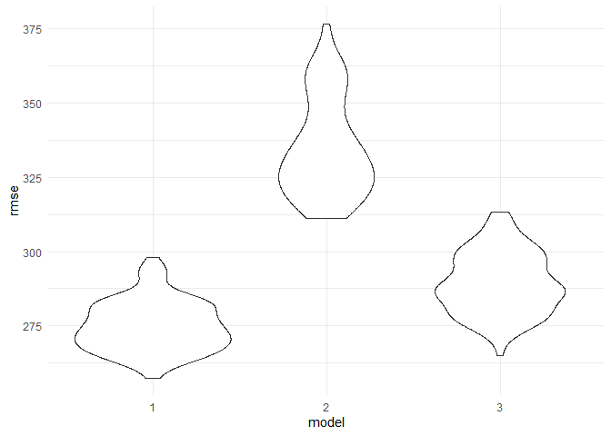

HW6
================
Ruihan Ding
2025-12-03

# Problem 1

Import and clean the data.

``` r
homicide_df = 
  read_csv("data/homicide-data.csv") |> 
  mutate(
    city_state = str_c(city, ", ", state),
    resolved = if_else(
      disposition == "Closed by arrest", 1, 0
    ),
    victim_age = as.numeric(victim_age),
    victim_sex = fct_relevel(victim_sex, "Female")
  ) |> 
  filter(
    !city_state %in% c("Dallas, TX", "Phoenix, AZ", "Kansas City, MO", "Tulsa, AL"),
    victim_race %in% c("White", "Black"),
    victim_sex %in% c("Female", "Male")
  )
```

    ## Rows: 52179 Columns: 12
    ## ── Column specification ────────────────────────────────────────────────────────
    ## Delimiter: ","
    ## chr (9): uid, victim_last, victim_first, victim_race, victim_age, victim_sex...
    ## dbl (3): reported_date, lat, lon
    ## 
    ## ℹ Use `spec()` to retrieve the full column specification for this data.
    ## ℹ Specify the column types or set `show_col_types = FALSE` to quiet this message.

    ## Warning: There was 1 warning in `mutate()`.
    ## ℹ In argument: `victim_age = as.numeric(victim_age)`.
    ## Caused by warning:
    ## ! NAs introduced by coercion

For the city of Baltimore, MD, use the glm function to fit a logistic
regression with resolved vs unresolved as the outcome and victim age,
sex and race as predictors.

``` r
fit_Baltimore = 
  homicide_df |> 
  filter(city_state == "Baltimore, MD") |> 
  glm(resolved ~ victim_age + victim_race + victim_sex, data = _, family = binomial())

fit_Baltimore |> 
  broom::tidy(conf.int = TRUE) |> 
  mutate(
    OR = exp(estimate),
    conf.low = exp(conf.low),
    conf.high = exp(conf.high)
  ) |> 
  knitr::kable()
```

| term | estimate | std.error | statistic | p.value | conf.low | conf.high | OR |
|:---|---:|---:|---:|---:|---:|---:|---:|
| (Intercept) | 0.3099810 | 0.1712948 | 1.809635 | 0.0703525 | 0.9757573 | 1.9107826 | 1.3633992 |
| victim_age | -0.0067272 | 0.0033235 | -2.024124 | 0.0429574 | 0.9868059 | 0.9997539 | 0.9932953 |
| victim_raceWhite | 0.8417563 | 0.1747162 | 4.817851 | 0.0000015 | 1.6496269 | 3.2759334 | 2.3204389 |
| victim_sexMale | -0.8544628 | 0.1381762 | -6.183864 | 0.0000000 | 0.3241908 | 0.5575508 | 0.4255117 |

The adjusted odds ratio for having a homicide solved, comparing male
victims to female victims while holding all other variables constant, is
0.43 with a 95% confidence interval of (0.32, 0.56).

Run glm for each of the cities in the dataset, and extract the adjusted
odds ratio (and CI) for solving homicides comparing male victims to
female victims.

``` r
fit_all = 
  homicide_df |> 
  select(city_state, victim_race, victim_age, victim_sex, resolved) |> 
  nest(data = -city_state) |> 
  mutate(
    fit = map(data, \(df) glm(
    resolved ~ victim_age + victim_race + victim_sex,
    data = df,
    family = binomial()
    )),
  results = map(fit, broom::tidy, conf.int = TRUE)
  ) |> 
  select(city_state, results) |> 
  unnest(results) |> 
  mutate(
    OR = exp(estimate),
    conf.low = exp(conf.low),
    conf.high = exp(conf.high)
  ) |> 
  filter(term == "victim_sexMale") |> 
  select(city_state, OR, conf.low, conf.high)

fit_all
```

    ## # A tibble: 47 × 4
    ##    city_state         OR conf.low conf.high
    ##    <chr>           <dbl>    <dbl>     <dbl>
    ##  1 Albuquerque, NM 1.77     0.825     3.76 
    ##  2 Atlanta, GA     1.00     0.680     1.46 
    ##  3 Baltimore, MD   0.426    0.324     0.558
    ##  4 Baton Rouge, LA 0.381    0.204     0.684
    ##  5 Birmingham, AL  0.870    0.571     1.31 
    ##  6 Boston, MA      0.667    0.351     1.26 
    ##  7 Buffalo, NY     0.521    0.288     0.936
    ##  8 Charlotte, NC   0.884    0.551     1.39 
    ##  9 Chicago, IL     0.410    0.336     0.501
    ## 10 Cincinnati, OH  0.400    0.231     0.667
    ## # ℹ 37 more rows

Create a plot that shows the estimated ORs and CIs for each city.

``` r
fit_all |> 
  mutate(
    city_state = fct_reorder(city_state, OR)
  ) |> 
  ggplot(aes(x = city_state, y = OR)) +
  geom_pointrange(aes(ymin = conf.low, ymax = conf.high)) +
  geom_hline(yintercept = 1, linetype = "dashed") +
  coord_flip() +
  labs(
    x = "City",
    y = "Adjusted OR (Male vs Female)",
    title = "Adjusted odds ratios for solving homicides by city"
  ) +
  theme_minimal()
```

<!-- -->

For the majority of cities, the estimated OR is below 1, indicating that
homicides involving male victims generally have lower odds of being
solved than those involving female victims after adjustment.

# Problem 2

Import data.

``` r
library(p8105.datasets)
data("weather_df")
```

Do bootstrapping.

``` r
bootstrap_results = 
  weather_df |> 
  bootstrap(n = 5000) |> 
  mutate(
    df = map(strap, as_tibble),
    fits = map(df, \(df) lm(tmax ~ tmin + prcp, data = df)),
    results1 = map(fits, broom::glance),
    results2 = map(fits, broom::tidy)
  ) |> 
  mutate(
    r2 = map_dbl(results1, "r.squared"),
    b1 = map_dbl(results2, \(df) df$estimate[2]),
    b2 = map_dbl(results2, \(df) df$estimate[3]),
    beta_ratio = b1/b2
  ) |> 
  select(.id, r2, beta_ratio)
```

Plot the distribution of the estimates.

``` r
bootstrap_results |> 
  ggplot(aes(x = r2)) +
  geom_density() +
  theme_minimal() +
  labs(
    x = expression(r^2),
    y = "Frequency",
    title = "Bootstrap distribution of R-squared"
  )
```

<!-- -->

``` r
bootstrap_results |> 
  ggplot(aes(x = beta_ratio)) +
  geom_density() +
  theme_minimal() +
  labs(
    x = expression(beta[1] / beta[2]),
    y = "Frequency",
    title = expression("Bootstrap distribution of " ~ beta[1] / beta[2])
  )
```

<!-- -->

Both bootstrap distributions are clearly skewed rather than symmetric,
so a normal-theory approximation is not ideal. For r2, the bootstrap
values are tightly concentrated around about 0.94, indicating
consistently high explained variation. For b1/b2, most estimates lie
roughly between −400 and −100, centered at a negative value. This
skewness in both summaries motivates using the bootstrap distribution
directly to obtain confidence intervals.

Identify the 95% confidence interval of the estimates.

``` r
bootstrap_results |> 
  pivot_longer(
    r2:beta_ratio,
    names_to = "estimate",
    values_to = "value"
  ) |> 
  group_by(estimate) |> 
  summarize(
    CI_lower = quantile(value, 0.025),
    CI_upper = quantile(value, 0.975)
  ) |> 
  knitr::kable()
```

| estimate   |     CI_lower |     CI_upper |
|:-----------|-------------:|-------------:|
| beta_ratio | -277.0724379 | -125.6524628 |
| r2         |    0.9345199 |    0.9467296 |

# Problem 3

Import and clean data.

``` r
bwt_df =
  read_csv("data/birthweight.csv") |> 
  mutate(
    babysex = factor(babysex, 
                     levels = c(1, 2), 
                     labels = c("male", "female")),
    malform = factor(malform,
                     levels = c(0, 1),
                     labels = c("absent", "present")),
    mrace = factor(mrace,
                   levels = c(1, 2, 3, 4, 8),
                   labels = c("White", "Black", "Asian", "Puerto Rican", "Other")),
    frace = factor(frace,
                   levels = c(1, 2, 3, 4, 8, 9),
                   labels = c("White", "Black", "Asian", "Puerto Rican", "Other", "Unknown"))
  ) |> 
  drop_na() |> 
  filter(mrace != "Unknown",
         frace != "Unknown")
```

    ## Rows: 4342 Columns: 20
    ## ── Column specification ────────────────────────────────────────────────────────
    ## Delimiter: ","
    ## dbl (20): babysex, bhead, blength, bwt, delwt, fincome, frace, gaweeks, malf...
    ## 
    ## ℹ Use `spec()` to retrieve the full column specification for this data.
    ## ℹ Specify the column types or set `show_col_types = FALSE` to quiet this message.

Build initial model.

``` r
bwt_model_0 = 
  bwt_df |> 
  lm(
    bwt ~ babysex + bhead + blength +
      delwt + fincome + frace +
      gaweeks + malform +
      menarche + mheight + momage + mrace +
      parity + pnumlbw + pnumsga +
      ppbmi + ppwt +
      smoken + wtgain,
    data = _
  )
```

Exclude insignificant variables.

``` r
bwt_model_0 |>
  broom::tidy() |> 
  drop_na() |> 
  filter(
    term != "(Intercept)", p.value < 0.05
  )
```

    ## # A tibble: 8 × 5
    ##   term          estimate std.error statistic   p.value
    ##   <chr>            <dbl>     <dbl>     <dbl>     <dbl>
    ## 1 babysexfemale    28.7      8.47       3.39 7.02e-  4
    ## 2 bhead           131.       3.45      37.9  2.16e-271
    ## 3 blength          75.0      2.02      37.1  1.75e-261
    ## 4 delwt             4.10     0.395     10.4  5.62e- 25
    ## 5 gaweeks          11.5      1.47       7.88 4.06e- 15
    ## 6 mraceBlack     -151.      46.0       -3.29 1.01e-  3
    ## 7 parity           95.5     40.5        2.36 1.83e-  2
    ## 8 smoken           -4.85     0.587     -8.27 1.78e- 16

``` r
bwt_model_1 = 
  bwt_df |> 
  lm(
    bwt ~ babysex + bhead + blength + delwt + gaweeks + mrace + parity + smoken,
    data = _
  )

bwt_model_1 |> 
  broom::tidy()
```

    ## # A tibble: 11 × 5
    ##    term              estimate std.error statistic   p.value
    ##    <chr>                <dbl>     <dbl>     <dbl>     <dbl>
    ##  1 (Intercept)       -5823.      98.8      -58.9  0        
    ##  2 babysexfemale        28.7      8.50       3.37 7.48e-  4
    ##  3 bhead               132.       3.46      38.1  1.21e-273
    ##  4 blength              75.9      2.02      37.5  3.02e-267
    ##  5 delwt                 2.26     0.196     11.5  2.05e- 30
    ##  6 gaweeks              12.1      1.47       8.28 1.57e- 16
    ##  7 mraceBlack         -147.       9.24     -15.9  3.06e- 55
    ##  8 mraceAsian          -71.6     42.5       -1.69 9.20e-  2
    ##  9 mracePuerto Rican  -120.      18.8       -6.37 2.04e- 10
    ## 10 parity               98.6     40.5        2.43 1.50e-  2
    ## 11 smoken               -4.75     0.588     -8.07 8.96e- 16

Look at residuals.

``` r
bwt_df = 
  bwt_df |> 
  add_residuals(bwt_model_1) |> 
  add_predictions(bwt_model_1)

bwt_df |> 
  ggplot(aes(x = pred, y = resid)) +
  geom_point() +
  labs(
    x = "Fitted values",
    y = "Residuals",
    title = "Residuals vs fitted values for birthweight model"
  ) +
  theme_minimal()
```

<!-- -->

I first fit an initial full linear regression model (bwt_model_0)
including all available predictors of birthweight. Then I used
broom::tidy() to examine the coefficient table and identified predictors
with p-values \< 0.05 (excluding the intercept). Based on these results,
I refit a reduced model (bwt_model_1) that keeps only the significant
variables (baby’s sex, head circumference, length, maternal delivery
weight, gestational age, maternal race, parity, and smoking), yielding a
more parsimonious model.

The residuals are roughly centered around zero with no strong pattern
across fitted birthweights, suggesting the linearity assumption is
reasonable and variance is approximately constant. A few large residuals
appear as outliers, but there is no obvious severe violation of model
assumptions.

Compare with two other models.

``` r
model_1 = bwt ~ babysex + bhead + blength + delwt + gaweeks + mrace + parity + smoken
model_2 = bwt ~ blength + gaweeks
model_3 = bwt ~ bhead * blength * babysex
```

Cross validate.

``` r
cv_df = 
  crossv_mc(bwt_df, n = 100) |>
  mutate(
    train = map(train, as_tibble),
    test = map(test, as_tibble)
  ) |> 
  mutate(
    bwt_mod_1 = map(train, \(df) lm(model_1, data = df)),
    bwt_mod_2 = map(train, \(df) lm(model_2, data = df)),
    bwt_mod_3 = map(train, \(df) lm(model_3, data = df))
  ) |> 
  mutate(
    rmse_1 = map2_dbl(bwt_mod_1, test, rmse),
    rmse_2 = map2_dbl(bwt_mod_2, test, rmse),
    rmse_3 = map2_dbl(bwt_mod_3, test, rmse)
  )
```

    ## Warning: There was 1 warning in `mutate()`.
    ## ℹ In argument: `rmse_1 = map2_dbl(bwt_mod_1, test, rmse)`.
    ## Caused by warning in `predict.lm()`:
    ## ! prediction from rank-deficient fit; attr(*, "non-estim") has doubtful cases

Plot the rmse of each model.

``` r
cv_df |> 
  select(starts_with("rmse")) |> 
  pivot_longer(
    everything(), 
    names_to = "model", 
    values_to = "rmse", 
    names_prefix = "rmse_"
  ) |> 
  ggplot(aes(x = model , y = rmse)) +
  geom_violin() +
  theme_minimal()
```

<!-- -->

The plot shows the cross-validated RMSE distributions for the three
models. Model 1 has RMSE values concentrated at the lowest level, Model
2 has the highest RMSE values, and Model 3’s RMSE values lie between
those of Models 1 and 2.
